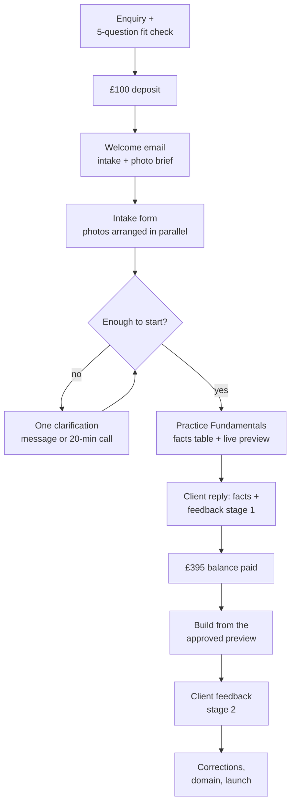

# Practice Fundamentals Intake System

2026-09-17 · @Someone

## Your hypothesis, tested

The order is right: pay, intake, review, follow-up, Fundamentals, approval, build. It fails in five places, and each one would cost you time or revisions.

| Gap in the hypothesis | What goes wrong | The fix |
| --- | --- | --- |
| No check before payment | Someone pays, then needs five pages, online booking or has no domain access. A refund costs more admin than a pre-check. | A 5-question fit check inside the enquiry, before the invoice. |
| Photography treated as one upload among many | It is the dependency most likely to stall a one-page site. You find out it is missing after the words are finished. | Ask about photos in the first form. If none are usable, send the brief the same day, so the shoot runs while you write. |
| Follow-up questions left open-ended | "Just a few questions" turns into a thread. | One message, at most five questions, with a reply-by date. If there is no reply, you go ahead on stated assumptions. |
| "Verify and approve" treated as one act | Clients skim a long document and approve facts they never checked. Wrong facts then turn up after launch. | Two separate asks in one message: tick each fact as correct, then approve the direction or ask for specific changes. |
| Approval covers words, not looks | Clients cannot judge colour and type from swatches. The real reaction comes when they see the built site, which is the costliest time to have it. | The Fundamentals must include a working opening-screen preview (desktop and phone), built in code with the real mark, palette, type and photo, which then becomes the website. |

Two commercial points are now settled, and the rest of this document follows them.

1. **£495 is a founding price, not a separate product.** The first three clients pay £495 for the same service that will normally cost £995. These founding projects are for measuring real delivery time, finding bottlenecks and gathering evidence. The process is therefore designed for the £995 service, and the first three are allowed to earn less per hour.
2. **The deliverable stays the complete Practice Fundamentals.** Shortening the document for founding clients would test a smaller service than the one you intend to sell. The comparison is in *The Fundamentals, the direction approval and the photo brief*. The recommendation is the full 11-page document, produced from a tightly controlled template.

## Which intake model

**Use a hybrid: one form in several short sections, with saved progress, answered by typing or by voice note.** The factual questions are always typed. The reflective ones can be typed or spoken, and everything lands in one place. The written follow-up and an optional call sit behind the form. They are not stages of their own.

| Criterion | 1. One long form | 2. Short form, then a deeper one | 3. Async written interview | 4. Voice or video only | 5. Live discovery call | 6. Hybrid (recommended) |
| --- | --- | --- | --- | --- | --- | --- |
| Client effort | High, in one go | Medium, split in two | Medium, spread over days | Low to speak, high to organise | Low (one hour) | Medium, their choice of pace |
| Completion rate | Lower; it stalls midway | Good, but the second form lags | Stalls between turns | Good for talkers, poor for others | Very high | High |
| Depth and specificity | Good if the prompts are good | Good | Very good | Very good (natural language) | Good, but held in your notes | Very good |
| Save and return | Depends on the tool | Needs two links | Built in | Poor (one take) | Not applicable | Built in |
| Accessibility and neurodiversity | Mixed: a wall of fields | Better | Good | Excludes people who dislike recording | Poor for people who process in writing | Best: text or voice, with short sections |
| Uploads | Yes | Yes | Awkward (email attachments) | Separate | Separate | Yes, inside each relevant section |
| Risk of vague answers | Medium | Medium | Low (you probe) | Low | Low | Low (examples and the "real phrases" prompts do the probing) |
| Your time | Low | Low | High: many turns | High: listening and transcribing | 1–1.5 hours, plus notes and scheduling | Low to medium |
| Follow-up needed | Medium | Medium | Is the follow-up | Medium | Low | Low: one batched message |
| Fit for this service (£495 founding, £995 normal) | Good | Adequate | Poor | Poor as the only method | Poor as a default | Best |
| Feels professional | Can feel like an assignment | Feels bureaucratic ("another form") | Personal | Personal | Reassuring | Calm and considered |

Why not the others:

- **Model 2 (two forms)** looks lighter but doubles the chasing. The second form is always the one that goes unanswered. Sections with saved progress give the same relief without a second deadline.
- **Model 3 (written interview)** gives the best material and the worst economics. Even at £995 you cannot hold six rounds of messages per client.
- **Model 4 (voice only)** is excellent source material, but it cannot carry facts such as fees, registration numbers or the domain. Offer it as an option, never as the main method.
- **Model 5 (discovery call)** is the one to resist most. It feels thorough, but it adds scheduling, and the "facts" end up in your notes rather than the client's own written words. That matters when they later verify their claims. Offer a 20-minute call only as a fallback (see the next section).

Spoken answers go in as a file upload on each reflective question. Voice notes from a phone (.m4a, .mp3) or a short video are fine. You transcribe them with the tool you already use and read the transcript alongside the typed answers. There is no separate system.

## The journey decisions

| Decision | Answer | Why |
| --- | --- | --- |
| Intake before or after payment? | **A 5-question fit check before. The full intake after the deposit.** | The fit check catches scope mismatches for free. The full intake is real work for the client and should come once they are committed. |
| How is payment structured? | **£100 deposit** reserves the project and releases the intake. **£395 balance** is invoiced when the client approves the Practice Fundamentals and visual direction. **The website build starts once the balance is paid.** | The deposit commits the client without asking them to risk the full amount before seeing any work. The approval point protects both sides: they have seen and approved the direction, and you are paid in full before completing the website. |
| Full payment upfront? | **Not now.** Keep it as an option for later, if chasing balances becomes a real cost. | One invoice is less admin, but it removes the client's protection at the point they most need it. |
| Checkout? | **Invoice and bank transfer, two invoices.** | This is your locked method. A Stripe Payment Link per invoice is the whole upgrade if card payment ever proves necessary. |
| What arrives right after the deposit? | **One welcome email** with the intake link, a printable copy of the questions, the photography brief, what happens next in four lines, and a suggested finish date (10 days). | Everything needed to start is in one place, and the photography lead time starts on day one. |
| One form or several? | **One form, nine short pages, each clearly labelled** (see the next section). | One link and one deadline. The labels make it read as a few essentials plus invitations, not an exam. |
| Save and return? | **Yes, essential.** | Reflective answers are written over several sittings. |
| Voice or video? | **Yes, for reflective questions.** Facts are always typed. | Speaking gives you natural language. Typed facts give you something exact to verify. |
| When are uploads requested? | **Inside the form, in the section they belong to.** Photos over the upload limit go via a shared-folder link. | Material sits next to the context that explains it. |
| When is photography raised? | **Immediately after the deposit.** The brief goes out with the welcome email. If there are no usable photos, the shoot is arranged while the client fills in the intake, not after approval. | Photography is the dependency most likely to stall the build. |
| When is a call offered? | **Never by default.** Offer one 20-minute call, included, in three cases: writing and voice notes both feel like barriers; answers conflict in a way a message cannot resolve; or the direction "feels wrong" and the client cannot say why. | A call is a tool for unblocking, not a stage. One per project. |
| Very little information? | **Do not start the clock.** The minimum is every required fact plus answers (typed or spoken) to at least four of the seven core questions. Below that, send the "thin intake" version of the clarification email. | Starting on thin material is where generic work comes from. |
| An enormous amount? | **Read it in a fixed order and timebox it to 90 minutes:** facts, then their own phrases and existing writing, then everything else, reading for what repeats. | The welcome email says "more is welcome; I read for what repeats". |
| How does factual verification work? | **A facts table** is sent with the draft, listing every public claim with a Correct / Change column. Nothing is published unconfirmed. | It separates "is this true?" from "do I like this?", in writing. |
| When is the direction formally approved? | **At the Practice Fundamentals**, in one reply covering facts and direction, including the working opening-screen preview. Approval triggers the £395 balance invoice. | This is the cheapest point to change course, and the natural payment point. |
| How is feedback structured? | **Two feedback stages.** Stage 1: one consolidated round of adjustments to the Practice Fundamentals and visual direction. Stage 2: one consolidated round of feedback on the built website. Each is one written list, sent in one message. | Feedback lands where changes are cheapest. Stage 2 refines the approved direction; it is not a chance to restart with a different look. |
| What doesn't count as a stage? | **Corrections:** factual errors, anything that rests on a misunderstanding on your side, and anything that departs from the approved direction. | Your mistakes should never use up the client's feedback. |
| The client withdraws before approving? | **Decide what the deposit covers at that point** (the intake reading and the Fundamentals work done). Have the wording reviewed before the first deposit. | Both sides should know the position in advance. |

**Open question for later:** the published £995 structure is currently "£500 to begin, £495 when you approve the finished website". If the deposit-then-direction shape works on the founding projects, decide whether £995 moves to the same shape (for example £100 plus £895 after direction approval) before you change anything public.

## 1. The recommended intake system

**Before paying:** a therapist answers a 5-question fit check inside your normal enquiry.

**Deposit and intake:** a **£100 deposit** reserves the project. It releases one welcome email with the intake link, a printable copy of the questions and the photography brief. The intake is one clearly labelled Tally form with saved progress. It holds the required facts (typed), seven core questions, and optional context, references and uploads, which can be typed or spoken. You read it in a fixed order and send one clarification message of up to five questions, or none.

**Fundamentals and approval:** you produce the complete **11-page Practice Fundamentals** from a controlled template. It includes a facts table and an opening-screen preview built as real code, which becomes the website. The client sends one reply that confirms each fact and either approves the direction or asks for one consolidated set of adjustments (**feedback stage 1**). Approval triggers the **£395 balance**.

**Build and launch:** once the balance is paid, you finish the build from the approved preview. The client gives one consolidated round of feedback (**feedback stage 2**), and you correct and launch.

A 20-minute call exists only to unblock, never as a stage. The client sees five actions: **pay the deposit, fill in, approve, pay the balance, review.**

## 2. The client journey

The client does five things: pay the deposit, fill in the form, approve, pay the balance and review. Everything else is your work.

The diamond is your judgement, never an automation. The two payments sit exactly where the client's commitment changes: before the intake, and after the direction is approved.

| Step | Who | Target time | Estimated hours (founding) |
| --- | --- | --- | --- |
| Fit check and deposit invoice | You | Same or next working day | 0.25 |
| Intake, with photos arranged in parallel | Client | Suggested 10 days; reminder at day 7 | — |
| Read the intake and send clarification (if needed) | You | Within 2 working days | 1.5 |
| Strategy and words: position, cards, belief, descriptions, voice | You | Fundamentals within about 7 working days | 4 |
| Visual system: mark, palette, type, photography direction | You | Same window | 4 |
| Opening-screen preview, built in code | You | Same window | 3 |
| Assemble the 11-page Fundamentals and facts table from the template | You | Same window | 2 |
| Facts and direction reply (stage 1) | Client | 5 working days | — |
| Stage 1 adjustments; balance invoice | You | 2 working days | 1.5 |
| Balance payment | Client | Suggested 5 working days | — |
| Complete the build from the approved preview | You | 4 working days | 3 |
| Website feedback (stage 2) | Client | 5 working days | — |
| Stage 2 changes, corrections, domain, launch, final Fundamentals issue | You | 2–3 working days | 2 |
| Admin, invoices and messages | You | Throughout | 0.75 |
| **Total** |  | **About 5 weeks from a complete intake if replies are prompt** | **About 22 hours** |

### Economics

The hours above are estimates to be replaced by measurement. They assume the template and preview starter already exist; building those is set-up time, not client time.

| Price | At 22 hours (first projects) | At 16 hours (once the template settles) |
| --- | --- | --- |
| £495 founding | £22.50 an hour | £30.94 an hour |
| £995 normal | £45.23 an hour | £62.19 an hour |

The founding rate is acceptable because these projects are buying evidence. The £995 rate is what the process has to support. On each founding project, record:

- actual hours per row of the table above
- where the waiting happened, and for how long
- how many clarification questions were needed
- what stage 1 and stage 2 feedback actually asked for
- which intake questions produced material you used

After three projects, merge or drop any optional question that produced nothing usable in all three.

**One risk to accept knowingly:** the deposit does not cover the Fundamentals work if a client walks away after receiving it. That is the price of the client protection. The fit check is what keeps it rare.

### Scope wording (service page and agreement)

> **Founding price: £495** (normally £995), for the first three practices.
>
> **£100 to reserve your place.** You then receive the intake form.
>
> **£395 when you approve your Practice Fundamentals and visual direction.** Your website is completed once this is paid.
>
> **Included**
>
> - Your Practice Fundamentals, 11 pages: your position, practical facts, beliefs and boundaries, descriptions at several lengths, voice and vocabulary, logo or wordmark, colours, typography, photography direction, and a quick check for anything you write later
> - A responsive one-page website with an enquiry form and a reading control for text size and spacing
> - Connection to your domain, and launch
> - Two feedback stages: one on your Practice Fundamentals and visual direction, one on the built website
>
> **How feedback works.** Each stage is one consolidated set of changes. The website stage refines the direction you approved; it isn't a restart with a new look. Corrections never use up a stage. That covers factual errors, anything I've misunderstood, and anything that departs from the approved direction.
>
> **Nothing is published until you've confirmed every fact.**
>
> **Quoted separately:** additional pages, online booking or other integrations, print design, social media templates, ongoing marketing, and a change to a new direction after approval.
>
> &#91;Website Care: confirm whether the first year is included at the founding price.\]

## 3. Reverse-engineering the Maya document

Of the roughly 40 elements in Maya's 11 pages, about a third are facts only the therapist can give. About a quarter are raw material you interpret. The rest are your decisions. The things that make the document feel specific (the nine-word line, the central concern, the mark's idea, the Quick Check) are all decisions made from raw material. None of them should ever be a question in the form.

The **Source** column uses four labels:

- **FACT**: only the therapist can supply it, and it is always verified.
- **RAW**: personal material you interpret.
- **DECISION**: your strategic or design judgement, which the client approves but does not author.
- **LATER**: not needed at intake.

Form codes (A1, C3 and so on) refer to section 4.

### Page by page

| Page | What it does | What it depends on |
| --- | --- | --- |
| 1 Cover | Name, position line, room photograph, version | One fact (name), one decision (line), one supplied asset (photo) |
| 2 Your practice | Position, four cards (practitioner, people, concern, feeling), nine practical facts, portrait | The heaviest mix: four decisions sit on raw material; nine facts need verification |
| 3 What you stand for | Belief; does / does not do / will not claim; one demonstrated phrase; identity statement | Raw beliefs and boundaries, plus hard claim limits |
| 4 Words you already have | Descriptions at 9, 40, 100 and 300 words; where each goes; two rules | Your writing, built on verified facts |
| 5 Voice and vocabulary | Six things to say in order, seven voice habits, words in and out | Their natural language and dislikes, then your editing |
| 6 The mark | Concept, four lockups, sizes, clear space | Your design, within their boundaries |
| 7 Colours | 13 values with jobs, proportion, contrast limits | Your design, within their boundaries |
| 8 Type and pictures | Two faces with roles, fallbacks, two photographs and the "no others" rule | Your design plus their photos and comfort |
| 9 In the world | Website hero plus five other surfaces | Your implementation. Show only the surfaces the client will have: the website and an email signature, and others only when they are quoted |
| 10 Quick Check | Five tests drawn from the practice's own tensions | Entirely your decision |
| 11 Where next | Three-document system, corrections, version | Studio structure. With no separate Guide, this becomes "your files, and what can come later" |

### The full table

| Finished output | Raw information required | Source | Intake question or task | Req / opt | Verify? |
| --- | --- | --- | --- | --- | --- |
| Practice name and wordmark text | Exact public name; whether to use a practice name or personal name | FACT | A1, A3 | Required | Yes, spelling and form |
| Descriptor under the name (for example "Counselling · Bristol") | Profession title; public location | FACT (the wording is a DECISION) | A4, A7 | Required | Yes |
| Central positioning line (9 words) | How they work; beliefs; who contacts them; what those people say and hesitate over | DECISION from RAW | C1, C3, E1, E2, E3. **Never ask the client to write it** | — | Approve (direction), not fact |
| Practitioner card: approach | Modalities actually trained in | FACT | B4 | Required | Yes |
| Practitioner card: character ("legible rather than neutral") | How they come across; what clients notice | RAW → DECISION | F3, C4 | Optional ★ | Approve |
| The people | Who they see (age group, format); who tends to contact them | FACT (scope) + RAW (description) | A5, E1 | A5 required; E1 ★ | Scope verified; description approved |
| The central concern | Common thread in first messages and hesitations | DECISION from RAW | E2, E3, E4 | ★ / optional | Approve |
| The feeling to create | What they hope a visitor thinks or feels; hesitations the site must lower | DECISION from RAW | E7, E3 | Optional | Approve |
| Fee | Session fee(s), length, frequency; whether to publish | FACT | A9 | Required | Yes |
| Hours | Days and times, or "do not publish" | FACT | A11 | Required | Yes |
| Where | In person (area), online (where clients may be located), phone | FACT | A6, A7, A8 | Required | Yes |
| First call | Whether a free initial call exists, its length and format | FACT | A12 | Required | Yes |
| Payment | Method and timing | FACT | A13 | Required | Yes |
| Cancellation | Notice period and charge | FACT (never invented) | A14 | Required | Yes |
| Access | Step-free, stairs, toilet, parking, transport, waiting area | FACT (never assumed) | A17 (if in person) | Required if in person | Yes, line by line |
| Lower fee | Whether concessions exist, how many, conditions | FACT | A10 | Required | Yes |
| Reply time | Realistic reply time to enquiries | FACT | A15 | Required | Yes |
| Taking new clients | Current availability | FACT (changes often) | A16 | Required | Yes, again at launch |
| Portrait | A usable candid photo, comfort level, direction to camera | RAW + asset | I1, I3–I8; photo brief if none | Required (photo or brief) | Permission (I10) |
| Portrait caption and rationale | Why this photo exists | DECISION | — | — | No |
| Belief statement | What they believe about therapy that shapes their work | RAW → DECISION | C3 | ★ | Approve (it must be theirs) |
| What the practice does | Behaviours in the room; what a first session is like | RAW → DECISION | C1, C2 | ★ / optional | Yes: it is a behavioural claim |
| What it does not do | Things people may expect that they do not do | RAW + FACT | D2 (★), D1 (required) | Mixed | Yes |
| What it will not claim | Claims they are uncomfortable with; conditions not worked with | FACT (boundary) + studio rules | D3, D1. Studio rule: no outcomes, no invented bodies, no testimonials | Required | Yes |
| Demonstrated phrase ("No idea, honestly.") | Real, general phrases people use when they first make contact | RAW → DECISION | E2 (never identifiable) | ★ | Approve |
| Identity statement | Character plus belief | DECISION from RAW | F3, C3 | — | Approve |
| 9, 40, 100 and 300-word descriptions | All of the above; existing bios for tone | DECISION from RAW + FACT | G2 uploads; facts from A and B | — | Facts inside them, yes |
| Where each length goes | Directories they use | FACT (list) + DECISION | J7 | Optional | No |
| "Rules at every length" | Publish-fee consent; condition boundaries | DECISION from FACT | A9, D1, D3 | — | Approve |
| Six things to say, in order | The hesitations to answer first | DECISION from RAW | E3, C1 | ★ | Approve |
| Voice habits | Natural phrasing; existing writing; what sounds like them | RAW → DECISION | G1, G2, G3, voice notes | Optional | Approve |
| Words that belong | Their recurring words | RAW | G1, G2, E2 | Optional | Approve |
| Words to avoid | Their dislikes; sector clichés | RAW + DECISION | G4 | Optional | Approve |
| Mark concept | Any existing marks; ideas; symbols to avoid; meanings to respect; wordmark or symbol | DECISION within RAW boundaries | H1, H2, H5, H7, H9, H10 | H1 required, rest optional | Approve at direction |
| Lockups, sizes, clear space | Where the mark will be used | DECISION (uses are LATER) | J8 | — | No |
| Existing brand assets to keep | Logo files, colours, fonts | FACT | H1 + upload | Required (choice) | Yes |
| Colour palette and roles | Likes, dislikes, associations, cultural meaning, priority | DECISION within RAW | H3, H7, H9, H10 | Optional | Approve |
| Contrast limits | Accessibility standard | DECISION (studio: WCAG 2.2 AA) | — | — | No |
| Typefaces and roles | Type preferences, priority | DECISION within RAW | H4, H10 | Optional | Approve |
| Font licensing and fallbacks | — | DECISION | — | — | No |
| Photography direction | Comfort, direction, where they feel like themselves, privacy | RAW → DECISION | I4–I9 | I4, I5, I9 required | Approve |
| Room photograph | Room photo or availability; privacy (home practice) | FACT + asset | I2, I3, I9 | Required if in person | Permission, plus "nothing identifying" |
| "No others" (imagery never used) | Conventions they dislike | RAW + DECISION | H7, H8 | Optional | Approve |
| Opening-screen preview (built in code, becomes the site) | Everything above | DECISION | — | — | Approve at direction |
| Other surfaces (cards, letterhead, social) | Future needs | LATER (quoted separately) | J8 ("possibly later") | Optional | — |
| Email signature | Contact details | FACT | J2 | Optional extra | Yes |
| Quick Check | The practice's own tensions | DECISION | — | — | No |
| Facts table (new; not in Maya) | Every public claim | FACT | Built from A, B, D, J | — | **Yes, the core of verification** |
| Crisis signposting line (new) | Their preference for urgent-help wording | DECISION + FACT | D4 | Optional | Yes |

### What this means for the form

- **Facts only the therapist can supply** go in sections A, B, J, part of D and part of I. They are typed and required, with "I don't know yet" and "don't publish" options where honest. You never fill one in on their behalf.
- **Raw material you interpret** goes in sections C, E, F, G, H and the rest of I. These are optional, can be typed or spoken, and seven are starred as the core.
- **Your decisions** never appear as questions: the position line, central concern, feeling, identity statement, the four descriptions, voice rules, mark, palette, type, photo direction and Quick Check.
- **Later**: print and social templates, booking, extra pages, and the final "taking new clients" check just before launch.

## 4. The intake form, ready to build

The form is a welcome screen and nine short pages. Clients are told it usually takes 60–90 minutes, over as many sittings as they like, and that answers don't need to be polished. Never tell them how many questions there are. Conditional logic hides everything that doesn't apply, so most people see noticeably fewer fields than the tables below list. The form replaces the draft Website Content Questionnaire (v0.2, never approved) and keeps its best rules: no client material, the client never plans the page structure, domains stay in the client's name, and acknowledgements come at the end.

**Key to the tables:** \* = needed before publishing. ★ = core question (C1, C3, D2, E1, E2, E3, F3). To start, you need every required field plus at least four core answers, typed or spoken.

### How the form presents itself

The client should see five kinds of question and never a count. Each field carries one short label. In Tally, put the label in bold at the start of the help text, and use a small heading above each optional group.

| Label the client sees | What it covers | Fields |
| --- | --- | --- |
| **Needed before publishing** | Practical and professional facts, always typed | All of pages 1–2 except B3, B5 and B6; plus D1, D1a, D3, E8, F4, H1, H1a, I1, I2, I4, I5, I9, I10, J1–J5, J9 and K4 |
| **Core question** | The seven questions that give the most useful material, typed or spoken | C1, C3, D2, E1, E2, E3, F3 |
| **Optional: more context** | Further reflection and optional facts (any optional fact given is still verified) | B3, B5, C2, C4, D4, E4–E7, F1, F2, F5, G1, G3–G5, J6–J8, J10, K1–K3 |
| **Optional: ideas, references and files** | Visual ideas, existing material, photographs | B6, G2, H2–H10, I3, I6–I8 |
| **Prefer to talk?** | Voice notes or short videos | V3, V4, V5 |

**Order within pages 3–5:** required and core questions come first. Optional questions sit beneath a thin divider headed "If you'd like to add more".

- **Page 3:** C1, C3, D1, D1a, D2, D3, then C2, C4, D4, V3.
- **Page 4:** E1, E2, E3, then E4–E7, then E8 and V4.
- **Page 5:** F3, F4, then F1, F2, F5, G1–G5, V5.

Someone who stops at the divider on every page has still given you enough to start.

### Form settings

- **Save answers for later:** on. In Tally this saves progress in the respondent's browser, so the welcome email says "finish on the same device and browser".
- **Partial submissions:** on (Tally Pro), so you can see that someone has started without chasing them.
- **Hidden field** `ref`, passed in the link (`?ref=AW-001`), to match the response to the invoice.
- **Progress bar:** on. Each page has one heading and a one-line intro.
- **Notifications:** you get an email on submission. The respondent gets a confirmation email (message 4).
- **Voice notes:** one audio/video upload at the end of pages 3, 4 and 5 ("say the question number first").

### Before payment: the fit check (in your site's enquiry form)

| # | Question | Help / example | Type | Req | Why |
| --- | --- | --- | --- | --- | --- |
| P1 | What do you do, and where? | Your profession, your professional body, and whether you work in person (where), online or both. | Long text | \* | Confirms a qualified practitioner and the service area. |
| P2 | Is a single, well-made page enough for now? | One page can hold who you are, how you work, fees, practical details and a contact form. | Choice: Yes / I think so, tell me if not / No, I need: booking, several pages, a blog, other (text) | \* | Catches scope mismatches before money moves. |
| P3 | Do you have a domain name (web address)? | For example yourname.co.uk | Choice: Yes and I can log in / Yes, not sure about access / No | \* | Domain access is a common launch blocker. |
| P4 | Do you have recent photos of yourself, or could you arrange some within about two weeks? | Natural, not formal. A friend with a phone is usually enough. | Choice: Yes / Could arrange / Not sure | \* | Photography is the most likely delay. |
| P5 | Is there a date you need it by? |  | Short text |  | Tells you whether you can take it on. |

### Welcome screen

The welcome text (message 3 in section 6), followed by a boxed note:

> **Please don't include anything about your clients.** I don't need, and don't want, names, initials, session content, or details that could identify a current or former client, even to themselves. Where I ask about the people you work with, please describe patterns, never individuals.

And a short **How this works** list:

- **Needed before publishing** marks the practical and professional facts. I need these before anything goes live. "I don't know yet" is an acceptable answer.
- **Core question** marks the seven questions that give me the most useful material. Please answer at least four, in writing or as a voice note.
- Everything marked **Optional** is an invitation to share more: context, ideas, references and files.
- It usually takes 60–90 minutes, over as many sittings as you like. Your answers save as you go, on the same device and browser.
- Rough notes are fine. Nothing needs to be polished.

### Page 1: Your practice, the facts

*Intro: "These are published as facts, so I need them exactly. 'I don't know yet' is a perfectly good answer. I'll never fill a gap with a guess."*

| # | Question | Help / example | Type | Req | Logic | Why |
| --- | --- | --- | --- | --- | --- | --- |
| A1 | Your name as it should appear publicly | Include a title such as Dr only if you're entitled to use it. | Short text | \* |  | Wordmark and every page. |
| A2 | Email address for this project |  | Email | \* |  | Correspondence and confirmation. |
| A3 | Should the practice appear under your name, or a practice name? |  | Choice: My name / A practice name | \* | "Practice name" shows A3a | Decides the wordmark and domain. |
| A3a | The practice name, exactly as it should appear | Capitals and punctuation matter. | Short text | \* | Shown if A3 = practice name | As above. |
| A4 | The professional title you use | For example counsellor, psychotherapist, counselling psychologist. Some titles are legally protected, so please use the one you're entitled to use. | Short text | \* |  | Descriptor line; legal accuracy. |
| A5 | Who do you work with? |  | Checkboxes: Adults individually / Couples / Families / Young people / Children / Groups / Other | \* | Young people or Children shows A5a | Scope statement. |
| A5a | What age range do you work with? |  | Short text | \* | Shown as above | Safeguarding-accurate wording. |
| A6 | How do you work? |  | Checkboxes: In person / Online video / Telephone / Outdoors (walk and talk) / Other | \* | Drives A7, A8, A17, I2 | Format facts. |
| A7 | Where? Give the area you're happy to publish. | For example "Didsbury, Manchester". | Short text | \* | Shown if In person or Outdoors | Location facts and descriptor. |
| A7a | Should your full address appear on the website? |  | Choice: Yes / No, I'll give it after first contact / Not decided | \* | As A7 | Privacy and safety. |
| A8 | Where can your online or phone clients be located? |  | Choice: UK only / UK and elsewhere (say where) / Not sure | \* | Shown if Online or Telephone | Avoids an inaccurate reach claim. |
| A9 | Your fees and session lengths | Every kind of session you offer, for example "Individual, £60, 50 minutes, weekly". Include any assessment fee. | Long text | \* |  | The most-copied facts in the pack. |
| A9a | Can your fees be published on the website? |  | Choice: Yes / I'd prefer not (say why) | \* |  | Decides the "fee always appears" rule. |
| A10 | Do you offer reduced fees or concessions? |  | Choice: No / Yes / Yes, but don't publish | \* | Yes shows A10a | Lower-fee fact. |
| A10a | Tell me how they work | How many places, for whom, any conditions. | Long text | \* | Shown if Yes | Exact wording for the site. |
| A11 | When do you usually see clients? | For example "Tuesday to Thursday, 9am to 7pm". Or write "don't publish". | Short text | \* |  | Hours fact. |
| A12 | How does someone start with you? |  | Choice: Free initial call / Free initial session / Paid initial session / Straight into a first session / Other | \* | Always shows A12a | First-contact fact; lowers the biggest barrier. |
| A12a | The details | Length, format and any fee. For example "20 minutes, by phone". | Short text | \* |  | As above. |
| A13 | How and when do clients pay? | For example "Bank transfer after each session". | Short text | \* |  | Payment fact. |
| A14 | What is your cancellation policy? | Notice period and any charge. If you don't have one yet, say so. I won't write one for you, but it needs deciding before launch. | Long text | \* |  | Never invented. |
| A15 | How quickly do you usually reply to enquiries? | For example "within two working days". | Short text | \* |  | Reply-time fact. |
| A16 | Are you taking new clients at the moment? | I'll check this again just before launch. | Choice: Yes / Waiting list / Opening on (date) / It varies | \* |  | Sets the contact wording. |
| A17 | Access to where you work | Step-free entrance? Stairs or lift? Accessible toilet? Parking, public transport, a waiting area? Describe only what you've checked. I'll publish exactly what you confirm. | Long text + checkbox "I need to check, I'll confirm later" | \* | Shown if In person | The claim most often wrong on therapy sites. |
| A18 | What length of work do you offer? |  | Checkboxes: Short-term (set number) / Open-ended / Other | \* |  | Sets expectations. |
| A19 | Which languages do you offer therapy in? |  | Short text, default "English" | \* |  | Language fact. |

### Page 2: Qualifications and professional details

*Intro: "Everything here may be published. Please write it exactly as it appears on your certificate or membership record. I won't add to it, round it up or reword it."*

| # | Question | Help / example | Type | Req | Logic | Why |
| --- | --- | --- | --- | --- | --- | --- |
| B1 | Qualifications you'd like listed | Full title, awarding body or college, and the year if you want it shown. | Long text | \* |  | Credential claims in your own words. |
| B2 | Professional body membership and registration | Body, membership level and number. Write "none" if that's the case. | Long text | \* |  | Registration is the claim clients check. |
| B2a | Should your membership number appear on the website? |  | Choice: Yes / No | \* | Hidden if B2 = "none" | Publishing consent. |
| B3 | Further training you'd like mentioned | Say what's complete and what's in progress. | Long text |  |  | Keeps in-progress training from being published as complete. |
| B4 | Approaches you're trained in | Only approaches you've trained in. If you'd describe yourself as integrative or pluralistic, say what you draw on. | Long text | \* |  | The practitioner card, with nothing assumed. |
| B5 | Anything else you'd like stated? | Tick only what's true and current. | Checkboxes: Regular clinical supervision / Professional indemnity insurance / Enhanced DBS check / Registered with the ICO / Work within a named ethical framework (say which) / Other |  |  | Optional trust facts, each confirmed by the client. |
| B6 | Any page that shows your professional details | For example a directory profile or membership page. Please don't send certificates, as I don't need them. | File upload (multiple) + URL field |  |  | Cross-checks spelling and wording. |

### Page 3: How you work, and what you don't do

*Intro: "From here on, answer in whatever way is easiest. Notes and half-thoughts are useful. ★ marks the questions that help me most. Prefer to talk? There's a voice-note upload at the bottom of the page."*

| # | Question | Help / example | Type | Req | Logic | Why |
| --- | --- | --- | --- | --- | --- | --- |
| C1 ★ | Imagine explaining what you actually do with someone to a friend who isn't a therapist. What would you say? | What happens, what you pay attention to, what you do when someone gets stuck. Everyday words work best. | Long text |  |  | Source for "what the practice does" and the position line. |
| C2 | What is a first session with you like, in practical terms? | How it starts, what you do or don't ask, how it ends, what you say about next steps. | Long text |  |  | Answers the biggest fear before contact, concretely. |
| C3 ★ | What do you believe about therapy that shapes how you work? Something you'd stand by if a colleague disagreed. | It might be about change, about the relationship, or about what people should or shouldn't need before they start. | Long text |  |  | The belief statement. This is what separates the practice from the category. |
| C4 | What do clients notice about you that they might not expect from a therapist? | Something clients have said in general terms, or that a supervisor or colleague has said. | Long text |  |  | Character shown through behaviour rather than adjectives. |
| D1 | Is there anything you don't work with, or would usually refer on? | For example "active addiction" or "people in immediate crisis". Write "nothing specific" if that's true. | Long text | \* |  | A hard boundary on claims. |
| D1a | Can this be mentioned on the website? |  | Choice: Yes / No, keep it private / Some of it (say which) | \* | Hidden if D1 = "nothing specific" | Publishing consent. |
| D2 ★ | What do people sometimes expect from a therapist that you don't do? | Give advice, set homework, diagnose, take notes in the room, stay silent, work to a fixed programme… | Long text |  |  | Source for "what it does not do", which is often the most distinctive line. |
| D3 | Are there claims you'd never want your website to make? | Whatever you tick, the site will never promise outcomes, use invented testimonials, or name qualifications, bodies or specialisms you haven't confirmed. | Checkboxes: That therapy will fix or cure something / A specialism I haven't trained in / "Evidence-based" as a selling point / That I offer crisis or emergency support / Testimonials or reviews / Numbers (years, clients seen) / "Safe space" promises / None of these / Other | \* |  | The "will not claim" list, agreed before writing starts. |
| D4 | How would you like urgent help to be signposted? | Every therapy website should say it isn't an emergency service and where to go instead. | Choice: Please write a standard line / I have wording I use (text) / Let's discuss |  |  | A line every site needs; its wording is then verified. |
| V3 | Prefer to talk? Upload a voice note or short video for any question on this page. | Say the question number before each answer. A phone voice memo is perfect. | File upload (audio or video, multiple) |  |  | Natural language from people who think out loud. |

### Page 4: The people who contact you

*Boxed note at the top: "Please describe patterns, never individuals. No names, initials, workplaces, distinctive events, or combinations of details that could identify a current or former client, even to themselves. Paraphrase and combine. If in doubt, leave it out."*

| # | Question | Help / example | Type | Req | Logic | Why |
| --- | --- | --- | --- | --- | --- | --- |
| E1 ★ | Who tends to contact you? Describe the people and their circumstances rather than diagnoses. | Life stage, what's going on around them, what has usually led up to the moment they get in touch. | Long text |  |  | "The people" card. |
| E2 ★ | What kinds of things do people say when they first get in touch? General, paraphrased phrases are perfect. | For example "I don't know if this is serious enough" or "everyone thinks I'm fine". The words people actually use are some of the most useful material you can give me. | Long text |  |  | The central concern, the vocabulary, and a demonstrated phrase. |
| E3 ★ | What makes people hesitate before contacting a therapist like you? | Cost, time, not knowing what to say, a bad past experience, worrying it's self-indulgent… | Long text |  |  | The order of "things to say"; the feeling to create. |
| E4 | Is there a common thread running through the people you work best with? | Only if one comes to mind. It doesn't need to be a niche. | Long text |  |  | Tests the central concern. |
| E5 | Who is probably not a good fit for you? Not clinically, but in terms of what they're looking for. | For example someone who wants a structured programme, or wants to be told what to do. | Long text |  |  | Helps the site let the wrong person self-select out. |
| E6 | Is there anyone you'd like to see more of? |  | Short text |  |  | Direction, only when it is true. |
| E7 | When your website is working well, what do you hope someone thinks or feels in the first ten seconds? |  | Long text |  |  | The feeling to create. |
| E8 | I've kept every example on this page general and non-identifying. |  | Checkbox | \* | Shown once any E field has an answer | A deliberate pause before the most sensitive page is submitted. |
| V4 | Prefer to talk? Voice note or short video. | Same rule: patterns, never individuals. | File upload (audio or video) |  |  | As V3. |

### Page 5: You, and your words

| # | Question | Help / example | Type | Req | Logic | Why |
| --- | --- | --- | --- | --- | --- | --- |
| F1 | What brought you to this work? | Share only what you'd be comfortable seeing on your website. I'll check anything personal with you before using it. | Long text |  |  | Depth for a longer description, when the client wants it. |
| F2 | Is there previous work or life experience that shapes how you practise, and that you're happy to mention? |  | Long text |  |  | Credibility and specificity without inventing any. |
| F3 ★ | How do you come across? Give three words people who know you well would use, and, if you can, something a colleague, supervisor or tutor has actually said about how you work. |  | Long text |  |  | The character line, taken from other people's words rather than self-praise. |
| F4 | How much of yourself should the website show? |  | Choice: Professional only / A little: a sense of who I am, no personal details / Quite open: personal background is welcome where it's relevant | \* |  | Sets the limit for all personal material. |
| F5 | Is there anything personal that must never appear? |  | Long text |  |  | A boundary. |
| G1 | Are there phrases you find yourself saying, to clients or when you describe your work? |  | Long text |  |  | Words that belong to the practice. |
| G2 | Please share any existing writing that sounds like you. | Website copy, directory profiles, bios, leaflets, business cards, posts, and replies you've sent to enquirers (with anything identifying removed). Drafts are welcome. | File upload (multiple) + long text for links or pasted text |  |  | The best evidence of natural voice. |
| G3 | Of what you've shared, what sounds most like you, and what doesn't? |  | Long text |  |  | Tells you which material to trust. |
| G4 | Are there words or phrases you'd rather never see on your website? | Tick any that make you wince, and add your own. | Checkboxes: journey / safe space / holding space / heal / transform / empower / unlock / reach out / take the first step / you are not alone / you deserve / non-judgemental / warm and friendly / struggling with / suffering from / book now / Other |  |  | Words to avoid, in their own reactions. |
| G5 | Anything about tone you feel strongly about? | Formal or informal, humour, first names, anything. | Long text |  |  | Catches strong views early. The voice itself is your call. |
| V5 | Prefer to talk? Voice note or short video. |  | File upload (audio or video) |  |  | As V3. |

### Page 6: How your practice could look

*Intro: "You don't need to arrive with design ideas. If you have some, this is the place for them, and they don't need to be developed or technically correct. Your answers set the boundaries, and turning them into a coherent identity is my job. You'll see and approve the direction before I build anything."*

| # | Question | Help / example | Type | Req | Logic | Why |
| --- | --- | --- | --- | --- | --- | --- |
| H1 | Do you have an existing logo, colours or fonts? |  | Choice: No / Yes, and they must stay / Yes, but I'm open to change / Yes, and I'd like them replaced | \* | Any "Yes" shows H1a | Retained assets are a hard constraint. |
| H1a | Please upload them | SVG, PDF, AI or EPS if you have them. PNG is fine. | File upload (multiple) | \* | Shown as above | You need the source files. |
| H2 | Do you already have any ideas about how your practice could look? | Tell me anything you've imagined about colours, fonts, logos, symbols, photography or general atmosphere. These ideas don't have to be developed or technically correct. Please also say which ideas matter to you and which are just possibilities you'd like me to consider. | Long text + file upload (sketches, moodboards, screenshots) + URL field (Pinterest or saved boards) |  |  | Every idea surfaced before design, not after. |
| H3 | Colours: any you like, dislike, or already connect with your practice? Any combinations you've imagined? |  | Long text |  |  | Boundaries for the palette. |
| H4 | Lettering: how do you feel about these styles? | Rows: Classic serif (like a printed book) / Clean, modern sans-serif / Handwritten or calligraphic / Traditional and formal / Contemporary and editorial / Minimal and quiet / Expressive, with character. | Matrix: Drawn to / Neutral / Not for me (or one choice question per row if your tool lacks matrices) |  |  | Type direction without asking them to pick fonts. |
| H4a | Any particular fonts you like or dislike? |  | Short text |  |  | Catches strong views. |
| H5 | What kind of logo appeals? |  | Choice: My name, well set (a wordmark) / My name with a small symbol / A distinctive symbol / Not sure, please decide |  |  | Sets the scope of the mark. |
| H5a | Any symbols, shapes, initials or images you've considered, or definitely don't want? |  | Long text + file upload |  |  | Wanted and ruled-out imagery. |
| H6 | Up to three things you respond to visually, and what you like about each | Websites, brands, books, packaging, interiors, places, anything. What you like about each matters more than the example itself. | 3 × (short text: link or description + long text: "What specifically do you like about it?") + file upload (screenshots) |  |  | Specific references with reasons, not a generic mood. |
| H7 | Are there common therapy-website looks you'd like to avoid? |  | Checkboxes: Pebbles and stones / Lotus flowers / Trees, leaves or roots / Hands / Sunrises or horizons / Butterflies / Jigsaw pieces / Head silhouettes / Sage green and beige throughout / Watercolour washes / Stock photos of sofas or tissues / Other |  |  | Rules out the category's defaults. |
| H8 | Is there anything visual that would make you immediately feel the design was wrong for you? |  | Long text |  |  | The single best revision-preventer. |
| H9 | Is there any personal, cultural, religious or professional meaning a design needs to respect? | For example a colour with a particular meaning in your community, or a symbol with associations you'd want to avoid. | Long text |  |  | Avoids unintended meaning. |
| H10 | How firm are your views? | Anything you mark as a firm requirement, I'll treat as fixed. Everything else is a steer. | Matrix, rows: Colours / Lettering / Logo / Photography / Overall atmosphere. Columns: Firm requirement / Strong preference / Open idea / Please decide for me / No view |  |  | Separates requirements from possibilities (dislikes are covered in H7 and H8). |

### Page 7: Photography

*Intro: "Photographs matter more than almost anything else on your website, because they let someone see who they'd be meeting and where. The minimum is a natural photograph of you, with several usable variations (at least one looking towards the camera), and a photo of the room if you see people in person. Natural means relaxed and easy to read, not a formal headshot, and not a snapshot caught by accident. If you don't have these yet, the brief in your welcome email explains how to get them, and it's worth starting now."*

| # | Question | Help / example | Type | Req | Logic | Why |
| --- | --- | --- | --- | --- | --- | --- |
| I1 | Do you have recent, good-quality photographs of yourself? |  | Choice: Yes / Some, not sure they're suitable / No | \* |  | Triggers the photo brief. |
| I2 | Do you have photographs of your therapy room or where you work? |  | Choice: Yes / No, but I can take some / No, I use a shared or rented room / I'd rather not show it (say why) | \* | Shown if A6 includes In person | The room photo. |
| I3 | Upload your photographs | Originals from your camera or phone are best, so please don't compress them. For very large files, add a shared-folder link. | File upload (multiple, images) + URL field |  | Shown if I1 or I2 = Yes or Some | Assets in context. |
| I4 | If your current photos aren't suitable, would you arrange new ones? |  | Choice: Yes, with a friend / Yes, with a photographer / I'd prefer not to, let's discuss | \* |  | Commits them to the photo route early. |
| I5 | How comfortable are you being visible on your website? | 1 = I'd rather not be pictured, 5 = entirely comfortable | Scale 1–5 | \* |  | Sets the photography direction's limits. |
| I6 | Your website needs at least one photo of you looking towards the camera. Beyond that, would you like others looking away, or a mixture? |  | Choice: Mostly towards / Some looking away / A mixture / No preference |  |  | Direction. |
| I7 | Where, or doing what, do you feel most like yourself? |  | Long text |  |  | Setting for a candid portrait. |
| I8 | Is there anything about how you're photographed that makes you uncomfortable? |  | Long text |  |  | Boundaries. |
| I9 | Are there privacy, safety or location reasons to limit what photos show? | For example you work from home, or you don't want the building to be identifiable. | Choice: No / Yes (shows a text field for details) | \* |  | Safeguarding. |
| I10 | I own these photographs or have permission to use them online, and anyone identifiable in them has agreed. |  | Checkbox | \* | Shown if I3 has files | Rights confirmation. |

### Page 8: The website and technical details

| # | Question | Help / example | Type | Req | Logic | Why |
| --- | --- | --- | --- | --- | --- | --- |
| J1 | What does someone need to be able to find, understand or do on your website? | For example "see my fees, understand how online sessions work, get in touch". You don't need to plan the page, as that's my job. | Long text | \* |  | Purpose, without asking them to design structure. |
| J2 | How should people contact you? |  | Checkboxes: Enquiry form / Email / Phone / Text message | \* | Email, Phone or Text shows J2a | Contact functionality. |
| J2a | Email address and/or phone number exactly as they should appear |  | Short text | \* | As above | A published fact. |
| J3 | Where should enquiry-form messages be sent? |  | Email | \* | Shown if Enquiry form | Form routing. |
| J4 | Do you have a domain name? |  | Choice: Yes, and I can log in / Yes, but I'm not sure I can access the account / No, please help me register one in my name | \* | Yes shows J4a; No shows J4b | Launch dependency. |
| J4a | Your domain and who it's registered with | For example yourname.co.uk, registered with \[company\]. | Short text | \* |  | Access planning. |
| J4b | Any domain names you'd like? |  | Short text |  |  | Registration. |
| J5 | Do you have a current website? |  | Choice: Yes / No | \* | Yes shows J5a and J5b | Migration and redirects. |
| J5a | Its address |  | URL | \* |  | Existing copy source. |
| J5b | What should happen to it? |  | Choice: Replace it at the same address / Keep it for now / Not sure | \* |  | Launch plan. |
| J6 | Email on your own domain (for example hello@yourname.co.uk)? | Setting this up isn't included, but I'll point you to simple options. | Choice: Already have it / I'd like it / Not needed |  |  | Flags the dependency early. |
| J7 | Directory profiles to link to | Links to any profiles you keep. | Long text |  |  | Where the 40-word description goes. |
| J8 | Anything you might want later? | Not included now. This helps me build so these are easy to add. | Checkboxes: More pages / Online booking / Articles / Business cards or leaflets / Social media graphics / Email signature / Help keeping the site updated / Other |  |  | Future development and quotable extras. |
| J9 | Do you already have a privacy notice for your practice? | The enquiry form collects personal information, so the website needs a privacy notice. | Choice: Yes (upload or link) / No / Not sure | \* | Yes shows an upload/URL field | A launch requirement, raised early. |
| J10 | Anything the people who visit your site might need for accessibility? | The site includes a reading control for text size, spacing and a calmer view as standard. | Long text |  |  | Audience-specific accessibility. |

### Page 9: Nearly done

| # | Question | Help / example | Type | Req | Logic | Why |
| --- | --- | --- | --- | --- | --- | --- |
| K1 | Is there anything that would help you during this project? | For example written communication only, longer reply times, or dates you're away. | Long text |  |  | Your own accessibility commitment. |
| K2 | Are there any dates I should know about? |  | Short text |  |  | Scheduling. |
| K3 | Anything else, at all | Notes, half-thoughts, things you nearly wrote earlier, material that feels like you. Nothing is too small or too messy. | Long text + file upload (multiple, any type) |  |  | The unrestricted dump, which often holds the best line. |
| K4 | Before you submit | All four are needed. | Checkboxes: (1) The practical and professional facts I've given are accurate and current. (2) Nothing I've shared identifies a current or former client. (3) I own, or have permission to use, the words, images and files I've supplied. (4) I understand nothing is published until I've confirmed the facts table. | \* (all four) |  | Accountability for facts, confidentiality and rights, in writing. |

## The Fundamentals, the direction approval and the photo brief

**Produce the complete 11-page Practice Fundamentals from a tightly controlled template, for founding and full-price clients alike.** The 6-page version stays as a fallback format, not the default.

### 6 pages or 11?

|  | 6-page streamlined | 11-page from a controlled template (recommended) |
| --- | --- | --- |
| What the client holds | A clear brief: position, facts, words, a condensed visual system, the preview | A reference they can use without you: all of the 6-page content, plus full voice rules, mark configurations, a palette where every colour has a job, type with fallbacks, photography rules, where the identity appears, and a Quick Check |
| Does it show "I understand your practice"? | Partly. It reads like a website brief. | Yes. Each page records a decision the client can act on. |
| Extra studio time per project | — | About 2–3 hours once templated. The decisions already exist; the extra pages set them out. |
| Main risk | Founding clients test a smaller service than the one you'll sell | Overrun if the template is loose; the client skims before approving |
| Fit with the £995 price | Weak. The visible difference from a general web designer shrinks. | Strong. The document is that visible difference. |

The value you're selling is *"I understand your practice, turn it into a coherent identity, and build a website that feels specifically like you."* The website shows the identity, and the Fundamentals shows the understanding. Cutting it to six pages removes the evidence for the part of the promise that justifies £995. The pages don't matter for their own sake. The document has to feel like something the therapist keeps using after launch.

### What "tightly controlled" means

- **Fixed page order and fixed slots with limits.** For example: position line up to 12 words; four cards of up to 35 words each; six things to say; up to seven voice habits; up to 20 words in each vocabulary list; 8–13 colours; two typefaces; four mark configurations.
- **One source file per client.** A single `identity.json`, as already used for Maya, feeds the document, the preview and the website. Every decision is typed once.
- **Only real surfaces.** Page 9 shows the website and an email signature, and other surfaces only when they have been quoted.
- **No Guide cross-references.** Page 11 becomes "your files, and what can come later".
- **A Quick Check of 3–5 questions drawn from this practice.** Never copied between clients.
- **Draft and final.** The draft goes out with the approval page on top, and page 9 shows the preview. The final issue comes with launch: page 9 shows the built site, and page 2 says "Facts confirmed on \[date\]".
- **Guarding against skimming.** The approval page points to page 2 (facts) and page 9 (preview) by number.

**Fallback rule:** if the document still takes more than about 8 hours after the template exists, compress pages 5 and 8 first. Keep position, facts, beliefs, words and the preview intact.

### Making the preview the first piece of the build

The opening screen is designed once, in the production codebase, and photographed for the document. No layout is drawn twice.

1. **Source.** The client's `identity.json` holds colours, type, spacing scale, logo files, photographs and the opening words.
2. **Tokens.** A small script turns that file into CSS custom properties. The website and the Fundamentals HTML template both read them.
3. **Build the hero for real.** Start the client's site from your one-page starter repository. Build only the header and opening section, to production standard: real content, real photographs, responsive, accessible, with the Reading control in place.
4. **Preview.** Deploy it to a Netlify branch preview (set to noindex). Capture 1440 px and 390 px screenshots with Playwright for page 9. You can also send the client the preview link so they can see it on their own phone.
5. **Stage 1 adjustments** are edits to the source file or that one section. The screenshots are recaptured, not redrawn.
6. **After the balance,** the build carries on in the same branch.

A design tool still earns its place for exploring the mark and palette before you commit. Use it for sketches only, never for page layouts.

The draft carries the approval page below at the front.

### The approval page (exact wording, placed at the front of the draft)

> **Before I build: the direction**
>
> Everything on your website will be built from this document: the words, the logo, the colours, the lettering, the photography, and the overall atmosphere you can see in the preview on page 9. This is the point to shape it.
>
> **1. Please check the facts.** The table on page 2 lists everything the website will state as fact. For each line, mark it **Correct** or write the change. Nothing is published until every line is confirmed.
>
> **2. Please look at the direction as a whole,** especially:
>
> - the overall look and atmosphere
> - the logo
> - the colours
> - the lettering
> - the photography direction
> - how the website feels on page 9
>
> Then send me **one reply** that says either:
>
> **A.** The direction feels right. Please go ahead.
>
> **B.** The direction is broadly right, but these specific things need adjusting: …
>
> This is your **first feedback stage**. Please gather everything into one reply. Honest first reactions are the most useful thing you can send. "This colour feels cold" or "this line doesn't sound like me" is enough, and you don't need to suggest the fix. If something feels wrong and you can't say why, tell me, and we'll have a 20-minute call.
>
> **What approval means.** Once you've approved the direction, I'll send the £395 balance invoice, and I'll complete your website when it's paid. The approved direction is the basis of the website. Your **second feedback stage** comes when the website is built. It's for refining and correcting (a word, a photo, a detail), not for starting again with a different look. If anything turns out to rest on something I misunderstood, putting it right is my responsibility, and it never uses up a feedback stage.

### Photography brief (one page, attached to the welcome email)

**Photographs for your website**

Two kinds of photograph do most of the work: a natural photo of you, and, if you see people in person, the room they'd walk into. They should feel like a real moment rather than a formal headshot.

**What I need**

1. **You, naturally.** At least 8–10 usable variations, several of them looking towards the camera and some looking away. "Natural" means relaxed, well lit and easy to read. It doesn't mean a formal headshot, or a blurred or awkward snapshot.
2. **You where you work.** A few frames of you in the room or place you work, doing something ordinary.
3. **The room, empty** (if you see people in person). 3–4 angles, including the view from the chair a client would sit in. Tidy but lived-in.

**How they should look**

- Daylight. Near a window, mid-morning or early afternoon. Turn the overhead lights off. No flash.
- Sharp focus on your eyes, and a steady camera.
- Both portrait and landscape versions of each set.
- Leave space around you. Step back rather than cropping close, so the photo can sit beside text and be cropped for phones.
- The camera at roughly eye level, or at seated height for the room.
- Wear what you'd wear to see clients. Plain fabrics or soft patterns (fine stripes shimmer on screens).

**Please avoid**

- Staged counselling scenes, or anyone pretending to be a client.
- Generic "therapy" props: a centred tissue box, a clipboard, a notepad on the knee.
- Forced smiles, or corporate headshot poses (unless that genuinely is you).
- Anything identifying: street views you'd rather keep private, notices, diaries, post, other people's belongings.
- Stock or AI-generated images of "a therapist".

**With a friend and a phone (about 30 minutes)**

1. Use the back camera of a reasonably recent phone, not the selfie camera, and wipe the lens.
2. Have your friend stand 2–3 metres away and use the 2× lens. Wide lenses distort faces up close.
3. Talk while they shoot. Tell them about your week. Look away, then back. Real expressions happen between poses.
4. Take lots, a hundred is normal. Send me your 20–30 favourites unedited, at full size, via a shared folder or file-transfer link. Not WhatsApp, which shrinks them.

**With a local photographer**

Ask for "natural-light portraits at my workplace, about an hour, 15–25 edited images, licensed for website and marketing use". Send them this page. Get the licence confirmed in writing, and make sure it covers the website and any future printed materials.

## 5. Technology

**Use Tally. Build and test on the free plan, and move to Pro (about $29 a month) the day the first founding client pays the deposit.** Keep invoice and bank transfer, and send emails from saved templates. Automate nothing else until you have five clients.

|  | [Tally](https://tally.so/pricing) (recommended) | [Jotform](https://www.jotform.com/pricing/) | [Fillout](https://www.fillout.com/pricing) |
| --- | --- | --- | --- |
| Price | Free; Pro $29/month or $290/year; Business $89/month ([help](https://tally.so/help/tally-pro)). The pricing page shows $24 and $74, which appear to be annual rates | Free Starter (5 forms, 100 submissions/month, 100 MB); Jotform's own Sept 2026 blog lists Bronze $39, Silver $49, Gold $129 a month ([blog](https://www.jotform.com/blog/notion-forms-alternatives/)). Pricing table not verified | Free; Starter $15, Pro $40, Business $75 a month billed yearly (monthly billing is roughly $19, $49 and $89) |
| Save and resume | **Free plan, but in the browser only**: same device and browser, not private windows ([help](https://tally.so/help/faq)) | **Best of the three:** a draft link by email or copied, works on any device, on all plans; drafts deleted after 2 months ([help](https://www.jotform.com/help/227-how-to-enable-autofill-on-forms/)) | Browser only on all plans. A cross-device resume email needs the $100/month add-on on Business ([help](https://www.fillout.com/help/partial-submissions)) |
| Conditional logic | Free | Free | Free |
| File uploads, including voice notes | Free: 10 MB per file. Pro: no size limit. Audio and video accepted ([help](https://tally.so/help/file-uploads)) | Default about 10 MB, adjustable up to 1 GB; storage capped by plan (100 MB free) ([help](https://www.jotform.com/help/33-changing-the-file-upload-size-limit/)) | 20 MB per file below Business; built-in voice-recording field ([help](https://www.fillout.com/help/voice-recording)) |
| Data and GDPR | Belgian company; data on Google Cloud in Belgium; files on Cloudflare EU; notification email via SendGrid (US); DPA included in the terms ([help](https://tally.so/help/gdpr)) | EU data centre in Frankfurt, available by switching in settings; self-serve signed DPA ([GDPR](https://www.jotform.com/gdpr-compliance/)) | US hosting by default; EU only on Team or Enterprise ([help](https://fillout.com/help/deployment-region.md)) |
| Confirmation to client / notification to you | Pro / Free ([help](https://tally.so/help/form-settings)) | Available; plan requirement not stated | All plans |
| Your own domain, no branding | Both on Pro | Branding removal on Bronze; own domain appears to be Enterprise only | No branding on Pro; own domain on Business |
| Feel for the client | Calm, document-like, one question after another | Capable but busier; the Card layout is calmer | Polished, flexible |

Checked 17 September 2026. Tally and Fillout bill in USD or EUR, and neither states VAT. Typeform was left out: on its self-serve plans data sits in the US, uploads are capped at 10 MB, Basic allows 100 responses a month, and an own domain needs Enterprise ([help](https://help.typeform.com/hc/en-us/articles/360060587391)).

### Why Tally despite weaker save and resume

Jotform wins on the criterion you listed first, so this is a trade-off. Tally wins on everything else that matters here: the calmest client experience, EU hosting with no paperwork, no upload size limit on Pro, your own subdomain (for example `intake.alexanderwatson.co.uk`) and the lowest price. Tally's browser-only saving has two workable fixes:

1. The welcome email says "finish on the same device and browser".
2. The welcome email attaches a **printable copy of the questions**, so people can draft anywhere and paste in later. It takes ten minutes to make and also helps people who prefer to think on paper.

**When to switch to Jotform:** a client loses work by changing device, or two of your first five clients ask to continue on another device.

### Checkout and automation

| Step | Tool | Automated? |
| --- | --- | --- |
| Enquiry and fit check | Your site's existing enquiry form, with P1–P5 added | No: you reply personally |
| £100 deposit | Invoice, bank transfer | No |
| Deposit confirmation (message 1) | Saved email template, sent when the deposit arrives | No: a two-minute step |
| Welcome and intake link (message 2) | Saved template; the link carries `?ref=AW-00X` | No |
| Form completion | Tally completion screen, confirmation email (Pro) and a notification to you | Yes, built in |
| Seven-day reminder (message 5) | A calendar reminder set when you send the link; check partial submissions first | No |
| Direction approved and £395 balance (message 8) | Saved template plus invoice | No |
| Files | Download from Tally to the client's project folder; delete from Tally at launch | No |

If you ever reopen card payment, use one [Stripe Payment Link](https://stripe.com/gb/pricing) per invoice. There is no monthly fee. Standard UK cards cost 1.5% + 20p: about £1.70 on the £100 deposit and £6.13 on the £395 balance, or about £3.00 and £11.26 on premium cards (2.8% + 20p). Don't add Zapier, a CRM or a client portal during the founding projects.

**Data housekeeping (your decision, not legal advice):** name Tally in your privacy notice as a processor for intake data. Set a retention period for intake responses and files (for example, delete from Tally at launch and keep your project copy for a fixed period you state). Say in the form that therapists shouldn't share their own health information unless they want it considered.

## 6. Client-facing messages

All of these are written to be saved as templates. Square brackets are the only parts you change. If the deposit and the intake link go out on the same day, send message 2 on its own, opening with the first two lines of message 1.

### Message 1: Deposit confirmation

**Subject:** Deposit received, your place is reserved

> Hi \[first name\],
>
> Thank you. I've received your £100 deposit, and your place is reserved. Your receipt is attached.
>
> Later today you'll get a separate email with the intake form. It's the only thing I need from you to begin.
>
> The £395 balance isn't due until you've seen and approved your Practice Fundamentals and visual direction.
>
> Alexander

### Message 2: Welcome email with the intake link

**Subject:** Your intake form, and how the next few weeks work

> Hi \[first name\],
>
> I'm looking forward to this. Everything starts with one form:
>
> **\[intake link\]**
>
> It usually takes 60–90 minutes, over as many sittings as you like, and nothing needs to be polished. Rough notes are genuinely useful.
>
> - **Needed before publishing** marks the practical and professional facts. "I don't know yet" is an acceptable answer.
> - **Core question** marks the seven questions that help me most. Please answer at least four, typed or as a voice note.
> - Everything marked **Optional** is an invitation to share more.
> - Your answers save as you go, as long as you come back on the same device and browser. A printable copy of the questions is attached if you'd rather draft elsewhere.
> - More is welcome. If you send a lot, I read for what repeats, so you won't be creating work for me.
> - Please don't include anything that could identify your clients.
>
> **Photographs: please look at this now.** The one-page brief attached explains what's needed: a natural photograph of you, with several variations (at least one looking towards the camera), and your therapy room if you see people in person. If you don't already have suitable photos, arranging them while you fill in the form avoids the most common delay.
>
> A good aim is to finish the form by **\[date, 10 days on\]**. If that doesn't suit, tell me a date that does.
>
> **What happens next**
>
> 1. Within two working days of receiving the form, I read everything. If anything's unclear, I send one short message of questions.
> 2. About a week later, you receive your Practice Fundamentals: your words, your practical facts, your visual identity, and a working preview of your website's opening screen.
> 3. You check the facts and either approve the direction or send one set of adjustments. This is the first of two feedback stages.
> 4. Once you've approved it, I send the £395 balance invoice, and I complete the website when it's paid.
> 5. You send one round of feedback on the finished website (the second stage). Then I make the corrections, connect your domain and launch.
>
> Everything happens in writing, so you can reply whenever it suits you. If a short call would help at any point, just say.
>
> Alexander

### Message 3: Introduction at the top of the form

> **Hello, and thank you.**
>
> This isn't a test, and you don't need polished answers. Bullet points, rough notes and half-formed thoughts are all useful, and often more useful than finished sentences, because they sound like you.
>
> The more you share, the more accurately I can make the identity and website feel like you and your practice. You don't have to answer everything.
>
> The exception is the practical and professional facts: fees, qualifications, memberships, access and similar. These are marked \*. I need them before anything is published, because I will never invent or assume them. If you don't know one yet, say so, and that counts as an answer.
>
> Everything else is an invitation. Answer what you can, skip what you can't, and use the last page for anything that doesn't fit anywhere else.

### Message 4: Completion screen (repeated in the confirmation email)

> **Thank you. That's everything I need to begin.**
>
> I'll read it all within two working days. If anything is unclear, you'll get one short message with questions. Otherwise I'll simply start, and your Practice Fundamentals will arrive about a week after that.
>
> If something occurs to you later, reply to your confirmation email. Anything you add before I start writing is useful.

### Message 5: Reminder after seven days

**Subject:** Your intake form, a gentle nudge

> Hi \[first name\],
>
> Just a gentle nudge about the intake form: \[intake link\]
>
> If you've started, your answers will still be there on the device and browser you used. If a question is holding you up, skip it. The facts marked \* are the only essentials, and a few rough notes on the rest are plenty. A voice note works too.
>
> If now isn't a good time, tell me when would suit and I'll plan around it.
>
> Alexander

### Message 6: Clarification (only when genuinely needed)

**Subject:** A few questions before I start

> Hi \[first name\],
>
> Thank you for the form. \[One specific, true sentence about what was useful, for example: "What you wrote about people who've 'already tried everything' will shape the opening of the site."\]
>
> Before I start writing, I have \[number\] questions. Short answers are fine, and a voice note works too.
>
> 1. &#91;Question\] *(If I don't hear back, I'll assume: \[assumption\].)*
> 2. &#91;Question\] *(If I don't hear back, I'll assume: \[assumption\].)*
> 3. &#91;Fact question\] *(I need this one before anything is published, so I'll leave a gap until you confirm it.)*
>
> If I haven't heard by **\[date, 3 working days on\]**, I'll carry on using those assumptions, and you can correct them when you see the draft.
>
> Alexander

**Variant for a thin intake** (replaces the questions; the clock has not started):

> To make this feel like you rather than a general therapy website, I need a little more to work from before I start. Rough answers to these three, even a few lines each, would be ideal:
>
> 1. If you were explaining to a friend, what do you actually do with the people you see?
> 2. What do people often say when they first get in touch? General phrases only.
> 3. What makes people hesitate before contacting you?
>
> A five-minute voice note covering all three is perfect. If talking it through would be easier, we can have a 20-minute call. Just send me two times that suit you.

### Message 7: Draft Practice Fundamentals, for fact-checking and approval

**Subject:** Your Practice Fundamentals, ready for checking

> Hi \[first name\],
>
> Your Practice Fundamentals is attached. It holds your words, your practical facts and how your practice looks. Page 9 shows a working preview of your website's opening screen on a computer and on a phone. \[You can also open it on your own phone here: preview link.\]
>
> This is your **first feedback stage**. I need two things, ideally in one reply by **\[date, 5 working days on\]**:
>
> **1. The facts.** The table on page 2 lists everything the website will state as fact. Please mark each line **Correct**, or write the change. Nothing is published until every line is confirmed.
>
> **2. The direction.** Please look at the whole document (the words, the logo, the colours, the lettering, the photography direction and the preview on page 9), then reply with either:
>
> **A.** It feels right. Please go ahead.
>
> **B.** Broadly right, but please adjust: \[the specific things, in one list\].
>
> First reactions are the most useful thing you can send. "This doesn't sound like me" is enough, and you don't need to suggest the fix. If something feels off and you can't pin it down, tell me, and we'll have a short call.
>
> **Once you approve,** I'll send the £395 balance invoice and complete your website when it's paid. The approved direction is the basis for the website. Your second feedback stage, on the built site, is for refining and correcting it rather than starting again with a different look. So this is the point to change direction before the build begins. If anything rests on something I misunderstood, putting it right is my responsibility and doesn't use up a stage.
>
> You can simply reply to this email. A list is perfect.
>
> Alexander

### Message 7a: Adjusted direction, for confirmation (after a "B" reply)

**Subject:** Your adjusted direction

> Hi \[first name\],
>
> Thank you for your notes. I've made the adjustments, and the updated Practice Fundamentals is attached. The changes are on pages \[x\] and \[y\], and the preview on page 9 has been updated.
>
> &#91;If I've interpreted a note in a particular way: one line saying how, and why.\]
>
> If this now feels right, a one-line reply confirming it is all I need. I'll then send the balance invoice.
>
> Alexander

### Message 8: Direction approved, balance invoice

**Subject:** Direction approved, your balance invoice

> Hi \[first name\],
>
> Thank you for approving the direction. The £395 balance invoice is attached.
>
> As soon as it's paid, I'll complete your website from the approved preview. I expect to send it for your second feedback stage by **\[date, about 4 working days after payment\]**.
>
> &#91;If any fact is still unconfirmed: "One detail still needs confirming before launch: \[fact\]."\]
>
> Alexander

## 7. One-day implementation checklist

This takes about seven hours and makes you ready to take the first founding deposit. The template work listed at the end needs doing before that client's Fundamentals is due, about a week after their intake.

**Morning**

- [ ] Record the founding offer in the decision register: three projects at £495 (£100 deposit, then £395 on direction approval), £995 afterwards, and the full 11-page Fundamentals. Note the open question about the £995 payment shape. (15 min)
- [ ] Add P1–P5 to your enquiry form, and add the founding scope wording to the service page as a draft. (45 min)
- [ ] Build the Tally form: welcome screen; pages 1–9 with the client labels; required and core questions first, with an "If you'd like to add more" divider; logic; the hidden `ref` field; saved progress; progress bar; completion screen (message 4). (2.5 h)
- [ ] Test it as a client on a phone and a laptop. Try every branch, an 8 MB photo and a voice memo, and close and reopen the form midway. Check that nothing mentions a question count. (45 min)

**Afternoon**

- [ ] Export the questions to a printable PDF for the welcome email. (15 min)
- [ ] Turn the photography brief, including the minimum set of photos, into a one-page PDF. (30 min)
- [ ] Save messages 1, 2, 5, 6, 7, 7a and 8 as email templates, and make two invoice templates: £100 deposit and £395 balance. (40 min)
- [ ] Add to the Website Agreement, flagged as unreviewed wording: the deposit, the balance trigger, build starting after the balance, the two feedback stages, what counts as a correction, and the position if a client withdraws before approving. (30 min)
- [ ] Name Tally in your privacy notice and set a retention period for intake data. (20 min)
- [ ] Add per-stage hour fields to each project in the dashboard, matching the journey table, plus notes on waiting time and feedback content. (15 min)

**Before the first Fundamentals is due (about 1–2 days of set-up, not client time):**

- [ ] The 11-page Fundamentals HTML template with fixed slots, driven by `identity.json` (adapted from Maya's source), plus the approval page.
- [ ] The one-page starter repository, reading the same tokens, with the Reading control in place and a Playwright script that captures 1440 px and 390 px screenshots.

**At the first deposit:** upgrade to Tally Pro and connect the `intake.` subdomain.

## 8. What stays a human judgement

The form and templates carry the admin. Every decision that makes the work specific stays with you.

- **Whether to take someone on:** your reading of the fit check, not a score.
- **Whether the intake is enough to start.** The four-★ rule is a floor, not a verdict.
- **Which follow-up questions are genuinely necessary,** and which assumptions are safe to state. Assumptions are never allowed for facts.
- **Confidentiality.** If an example could identify a client, delete it from your copy, don't use it, and tell the therapist plainly.
- **Reading for what repeats:** the central concern, the position line, the belief statement, and the order of things to say.
- **Personal material:** what from F1 and F2 to use, always checked with the therapist first.
- **Claims:** whether a sentence implies an outcome, a specialism or a credential the facts don't support.
- **Every design decision:** the mark, palette, type, photography direction, and whether the supplied photos are good enough or need the brief.
- **Interpreting feedback:** whether "it doesn't feel right" is a refinement, a correction on your side, or a genuinely new direction to quote for.
- **When a call is warranted,** and whether a request is out of scope.
- **The pre-launch check:** re-confirm fees and availability, then run the practice's own Quick Check against the built page.

* **Whether a founding project needs the 6-page fallback,** and whether a feedback note is a refinement, a correction on your side, or a new direction to quote for.

AI can transcribe voice notes, gather quotes by theme and draft variations for you to choose from. It must never fill a factual gap, write a claim nobody confirmed, or make the call on direction.
